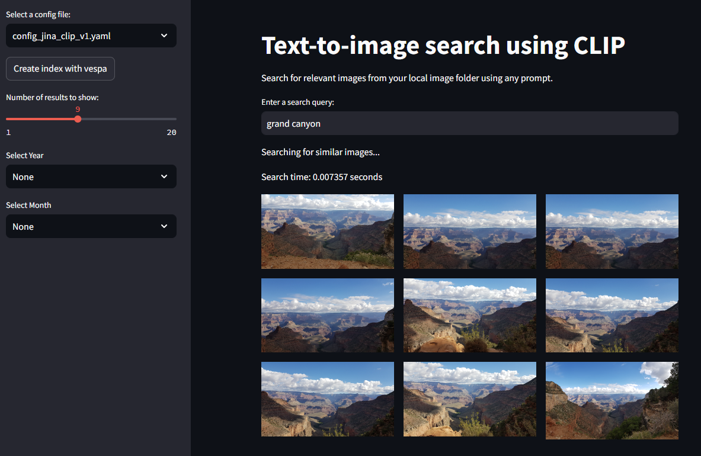

# Image Search Application with CLIP, Vespa and Streamlit

This project demonstrates an easy image search application using the CLIP, FAISS and Streamlit. The application allows users to search for relevant images from a local folder of images based on text queries.

## Features

- **Text-to-image Search**: Uses image embeddings that allows contextual search from images by text prompts.
- **CLIP Model**: Utilizes CLIP for image and text embeddings. Use clip-ViT-L-14 for more accurate results.
- **VESPA vector database** Uses Vespa for efficient hybrid search
- **FAISS vector database** Uses FAISS for efficient in-memory vector search
- **Streamlit Interface**: Provides a web interface for searching and viewing results.

# Streamlit App


## Prerequisites

- Python 3.10+
- Pip (Python package installer)

## Installation

1. **Clone the repository**:
    ```sh
    git clone https://github.com/jarkkotulensalo/multimodal-search.git
    cd multimodal-search
    ```

2. **Create and activate a virtual environment**:
    ```sh
    python -m venv venv
    source venv/bin/activate  # On Windows use `venv\Scripts\activate`
    ```

3. **Install the required packages**:
    ```sh
    pip install -r requirements.txt
    ```

4. (optional) Set-up vespa

    Follow the instructions to run Vespa in Docker.

    https://docs.vespa.ai/en/vespa-quick-start.html

    ```sh
    brew install vespa-cli

    vespa config set target local

    docker run --detach --name vespa --hostname vespa-container \
    --publish 8080:8080 --publish 19071:19071 \
    vespaengine/vespa
    ```


## Configuration

There are config templates ready for CLIP-ViT-L-14, CLIP-ViT-B-32, CLIP-ViT-B-32-multilingual and Jinaai/jina-clip-v1.

Currently the app is compatible with using vespa or faiss as the vector database.

1. **Set up the configuration file**:

    Create a `config.yaml` file in the `config` directory with the following content:
    ```yaml
    model:
      img_encoder: "clip-ViT-L-14"
      text_encoder: "clip-ViT-L-14"
      image_size: 336
      batch_size: 64

    vector_db:
      name: "vespa"

    images:
      name: "my_images"
      path: "/path/to/your/images"
    ```

2. **Update the path to your images**: Make sure to replace `/path/to/your/images` with the actual path to your local image and video dataset.

## Usage

1. **Run Vespa**
    ```sh

    docker start vespa
    vespa deploy --wait 300 vespa_app/
    ```


2. **Run the Streamlit application**:
    ```sh
    streamlit run app.py
    ```

    This will start a local web server and open the application in your default web browser.

3. **Run the indexing script**:
    Select a config file from the sidebar.

    Press: "Create Index"

    This button will run a script that processes the images and videos, extracts embeddings, and creates a vector database index for efficient searching.

4. **Search for images**:
    Enter a search query and press enter


## License

This project is licensed under the MIT License.

## Acknowledgements

- [CLIP](https://huggingface.co/sentence-transformers/clip-ViT-L-14) by OpenAI
- [Streamlit](https://streamlit.io/) for the web application framework
- [FAISS](https://github.com/facebookresearch/faiss) as vector database
- [Vespa](https://docs.vespa.ai/) as vector database
