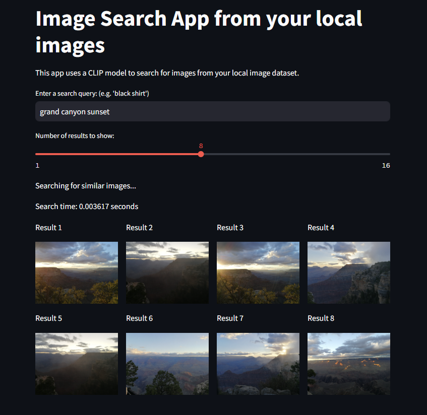

# Image Search Application with CLIP, FAISS and Streamlit

This project demonstrates an easy image search application using the CLIP, FAISS and Streamlit. The application allows users to search for relevant images from a local folder of imagess based on text queries.

## Features

- **Text-to-image Search**: Uses image embeddings that allows contextual search from image by text prompts.
- **CLIP Model**: Utilizes CLIP for image and text embeddings. Use clip-ViT-L-14 for more accurate results.
- **FAISS vector database** Uses FAISS for efficient in-memory vector search
- **Streamlit Interface**: Provides a web interface for searching and viewing results.

# Streamlit App


## Prerequisites

- Python 3.10+
- Pip (Python package installer)

## Installation

1. **Clone the repository**:
    ```sh
    git clone https://github.com/yourusername/multimodal-search.git
    cd multimodal-search
    ```

2. **Create and activate a virtual environment**:
    ```sh
    python -m venv venv
    source venv/bin/activate  # On Windows use `venv\Scripts\activate`
    ```

3. **Install the required packages**:
    ```sh
    pip install -r requirements.txt
    ```

## Configuration

1. **Set up the configuration file**:

    Create a `config.yaml` file in the `config` directory with the following content:
    ```yaml
    model:
      img_encoder: "clip-ViT-L-14"
      text_encoder: "clip-ViT-L-14"
      image_size: 336
      batch_size: 64

    images:
      name: "my_images"
      path: "/path/to/your/images"
    ```

2. **Update the path to your images**: Make sure to replace `/path/to/your/images` with the actual path to your local image and video dataset.

## Usage

1. **Run the indexing script**:
    ```sh
    python src/create_index.py
    ```

    This script processes the images and videos, extracts embeddings, and creates a FAISS index for efficient searching.

2. **Run the Streamlit application**:
    ```sh
    streamlit run src/app.py
    ```

    This will start a local web server and open the application in your default web browser.


## License

This project is licensed under the MIT License.

## Acknowledgements

- [CLIP](https://huggingface.co/sentence-transformers/clip-ViT-L-14) by OpenAI
- [Streamlit](https://streamlit.io/) for the web application framework
- [FAISS](https://github.com/facebookresearch/faiss) for efficient similarity search
